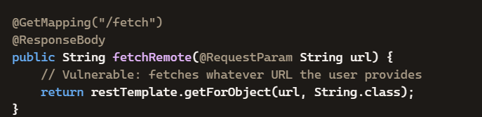
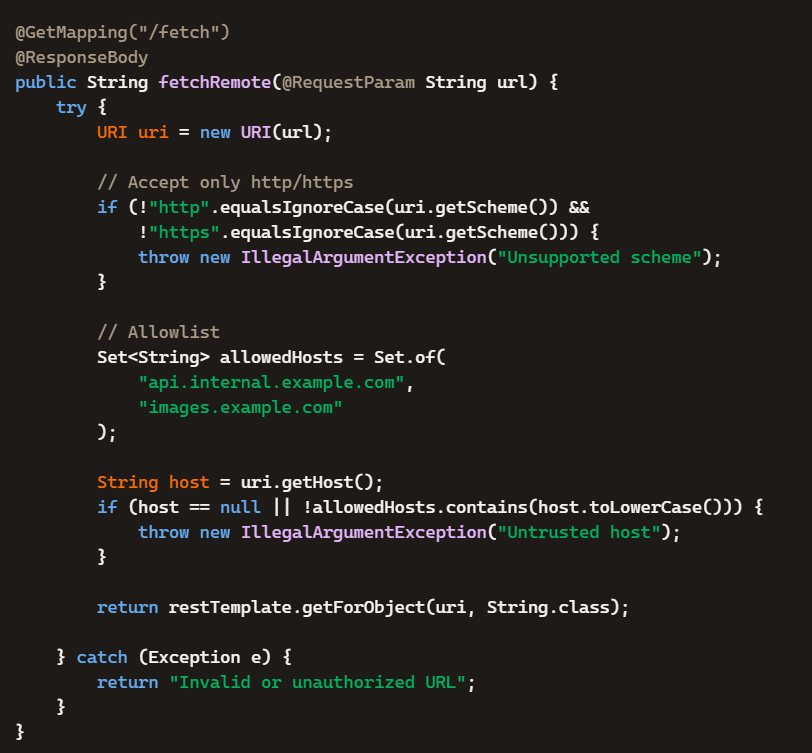
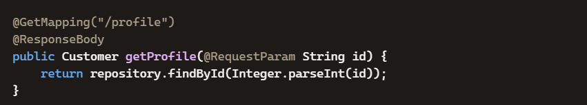
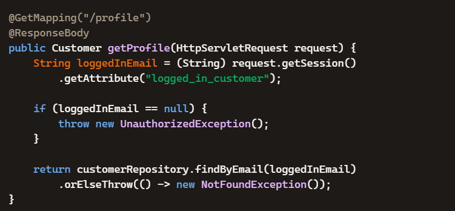
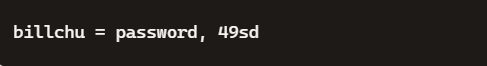
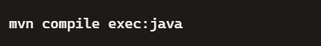

# Access Control and SSRF Remediation Project

This project demonstrates secure coding and access‑control remediation in a penetration‑testing training application. It covers mitigation of **Server‑Side Request Forgery (SSRF)**, **Insecure Direct Object Reference (IDOR)**, and **role‑based access control (RBAC)** vulnerabilities using **Java/Spring Boot** and **Apache Shiro**.

---

## 🧩 Project Overview
The application initially contained multiple injection and authorization flaws.  
This project implements three major fixes:

1. **SSRF Mitigation** – Validates and allowlists URLs before outbound requests.  
2. **IDOR Remediation** – Enforces object‑level authorization and session‑based access checks.  
3. **Access‑Control Enhancement** – Extends Apache Shiro configuration with a new role and permissions.

---
## 🧨 1. Server-Side Request Forgery (SSRF)

### 📖 Description
SSRF occurs when an application fetches a user-supplied URL without validation, allowing attackers to access internal services, metadata endpoints, or local files.

---

### ✔ Vulnerable Code

```java
@GetMapping("/fetch")
@ResponseBody
public String fetchRemote(@RequestParam String url) {
    return restTemplate.getForObject(url, String.class);
}
---
```
💥 Exploit Example

An attacker modifies the request:
```java
http://localhost:8080/actuator
file:///etc/passwd
```

### 🖼️ Vulnerability


🔎 Risk Impact
Severity: Critical
Risk: Internal network access
Impact: Exposure of system files, cloud metadata, and internal APIs
---
🛡️ Remediation

```java
URI uri = new URI(url);

// Only allow HTTP/HTTPS
if (!"http".equalsIgnoreCase(uri.getScheme()) &&
    !"https".equalsIgnoreCase(uri.getScheme())) {
    throw new IllegalArgumentException("Unsupported scheme");
}

// Allowlist trusted hosts
Set<String> allowedHosts = Set.of(
    "api.internal.example.com",
    "images.example.com"
);

String host = uri.getHost();
if (host == null || !allowedHosts.contains(host.toLowerCase())) {
    throw new IllegalArgumentException("Untrusted host");
}

return restTemplate.getForObject(uri, String.class);
```

🧨 2. Insecure Direct Object Reference (IDOR)
📖 Description

IDOR allows attackers to access unauthorized data by manipulating identifiers in requests (e.g., changing id values).

✔ Vulnerable Code
@GetMapping("/profile")
@ResponseBody
public Customer getProfile(@RequestParam String id) {
    return repository.findById(Integer.parseInt(id));
}

💥 Exploit Example
```java
/profile?id=886460
```
➡️ Returns another user's data

🖼️ Vulnerability Evidence


🔎 Risk Impact
Severity: High
Risk: Unauthorized data access
Impact: Exposure of personal and sensitive information

---

🛡️ Remediation

```java
@GetMapping("/profile")
@ResponseBody
public Customer getProfile(HttpServletRequest request) {

    String loggedInEmail = (String) request.getSession()
        .getAttribute("logged_in_customer");

    if (loggedInEmail == null) {
        throw new UnauthorizedException();
    }

    return customerRepository.findByEmail(loggedInEmail)
        .orElseThrow(() -> new NotFoundException());
}
```
---

🖼️ Remediation Result



---
🧨 3. Apache Shiro Access Control (RBAC)
📖 Description

Role-Based Access Control (RBAC) ensures users only access resources permitted by their assigned roles.

✔ Configuration Changes
```java

[users]
billchu = password, 49sd

[roles]
49sd = tesla:drive:*, winnebago:drive:*
```

🖼️ Users Configuration




🖼️ Roles Configuration


🔎 Risk Impact
Severity: Medium
Risk: Misconfigured permissions
Impact: Overprivileged or unauthorized access


🧪 Execution
```java
mvn compile exec:java

```


🖼️ Output




---


MIT License
Copyright (c) 2026
